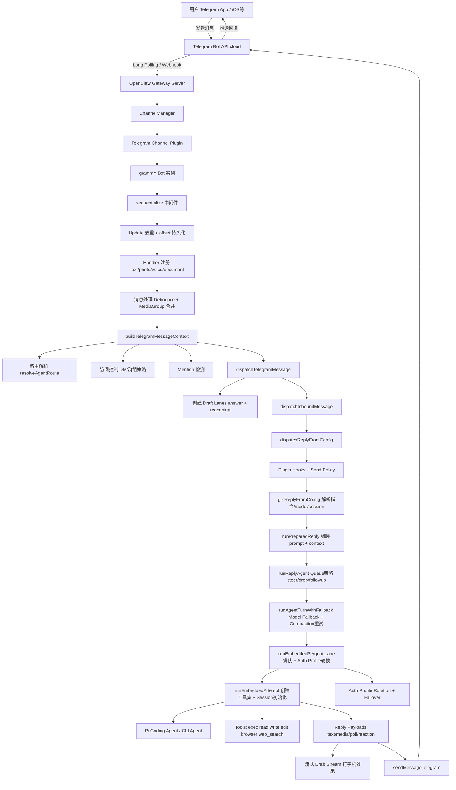
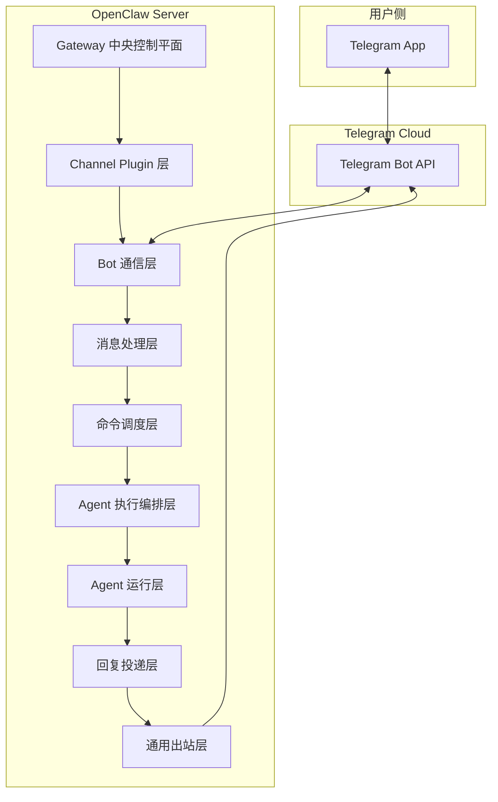
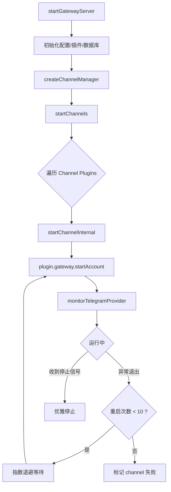
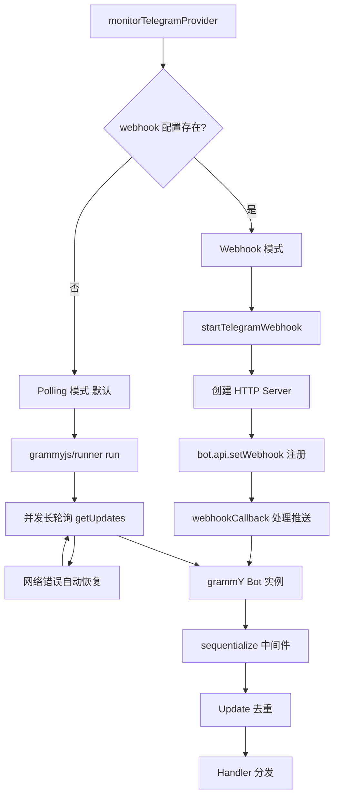
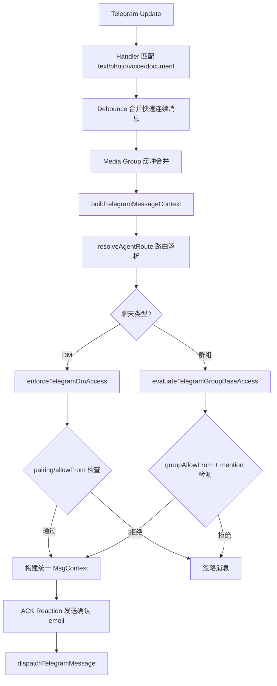
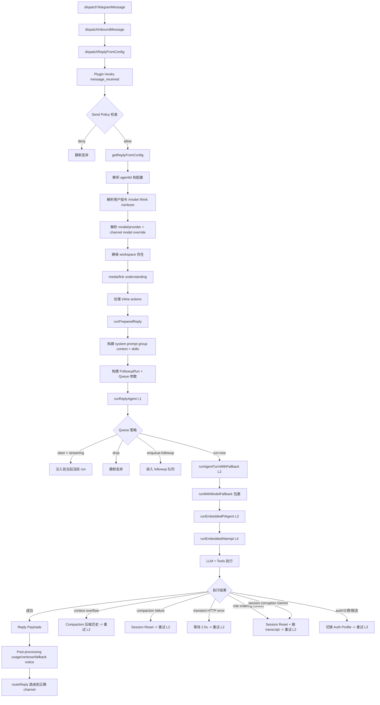
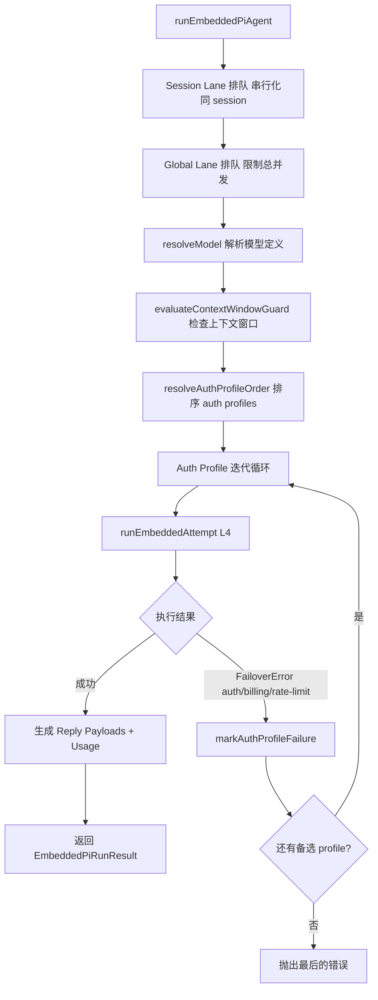
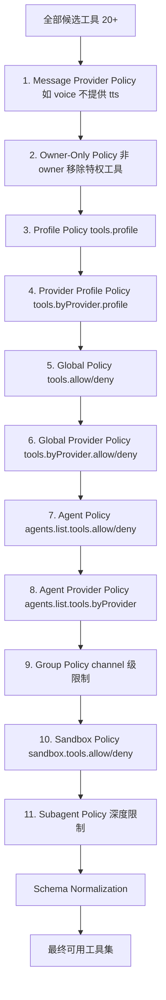
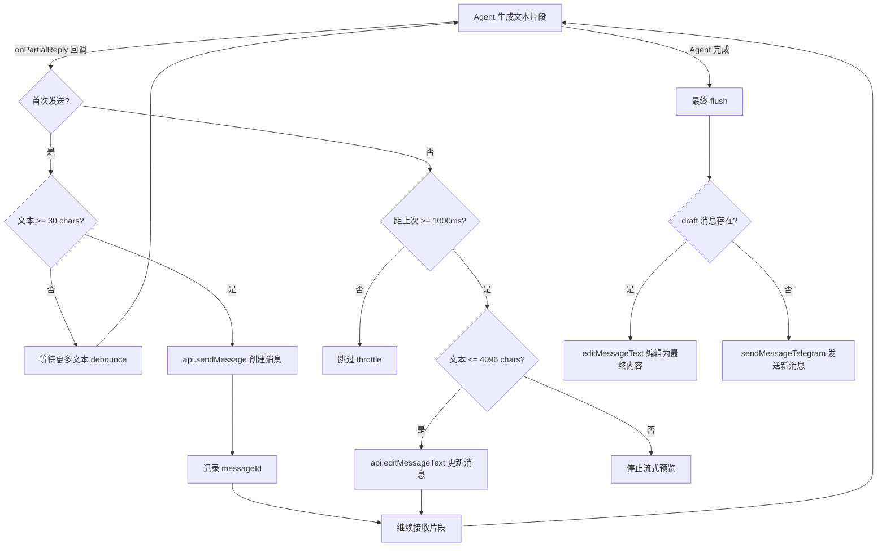
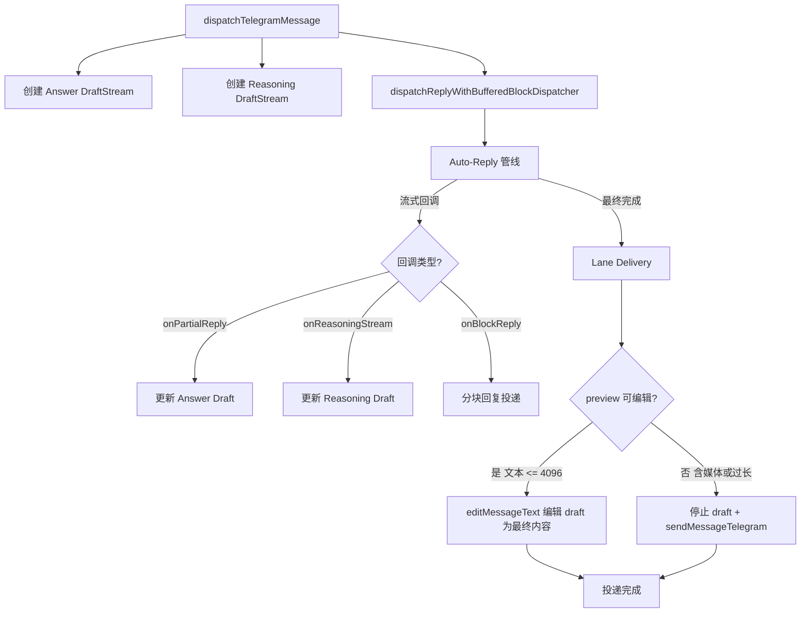

# Telegram 与 OpenClaw Agent 交互架构分析

## 1. 系统架构总览

### 1.1 端到端数据流



### 1.2 核心架构分层

Gateway 是整个系统的**中央控制平面** (Central Control Plane)，是唯一的常驻进程，桥接消息 channel、AI agent、CLI 客户端、浏览器 Control UI 和原生设备 Node。所有子系统均挂载于 Gateway，不直接互通，所有路由经由 Gateway 分发。

| 层次 | 职责 | 关键文件 |
|------|------|----------|
| **Gateway 层 (中央控制平面)** | 服务启动、子系统挂载、Channel 生命周期、WebSocket RPC、HTTP API、热重载 | `src/gateway/server.impl.ts`, `src/gateway/server-channels.ts`, `src/gateway/server-methods.ts` |
| **Channel Plugin 层** | Telegram 协议适配、Bot 管理 | `extensions/telegram/src/channel.ts` |
| **Bot 通信层** | 消息收发、Polling/Webhook | `src/telegram/monitor.ts`, `src/telegram/bot.ts` |
| **消息处理层** | Handler 注册、上下文构建、访问控制 | `src/telegram/bot-handlers.ts`, `src/telegram/bot-message-context.ts` |
| **命令调度层** | 路由解析、指令/command 解析、session 初始化、send policy | `src/auto-reply/dispatch.ts`, `src/auto-reply/reply/dispatch-from-config.ts`, `src/auto-reply/reply/get-reply.ts`, `src/routing/resolve-route.ts` |
| **Agent 执行编排层** | Queue 策略、Model Fallback、Compaction 重试、Block Reply Pipeline | `src/auto-reply/reply/agent-runner.ts`, `src/auto-reply/reply/agent-runner-execution.ts` |
| **Agent 运行层** | Lane 排队、Model 解析、Auth Profile 轮换、LLM 调用、工具执行 | `src/agents/pi-embedded-runner/run.ts`, `src/agents/pi-embedded-runner/run/attempt.ts`, `src/agents/pi-tools.ts` |
| **回复投递层** | 流式 draft、最终发送 | `src/telegram/draft-stream.ts`, `src/telegram/send.ts`, `src/telegram/lane-delivery.ts` |
| **通用出站层** | 跨 channel 投递抽象 | `src/infra/outbound/deliver.ts` |



---

## 2. 各层详细实现说明

### 2.0 Gateway 中央控制平面

Gateway 是 OpenClaw 的核心单进程服务，通过**单端口多路复用** (默认 18789) 承载所有流量:

| 流量类型 | 协议 | 用途 |
|----------|------|------|
| WebSocket RPC | ws:// | CLI、Control UI、Channel Plugin、Node 客户端的控制通信 |
| Control UI | HTTP | 浏览器 SPA 仪表盘 |
| OpenAI 兼容 API | HTTP | 外部 API 调用 |
| Tools invoke | POST /tools/invoke | 外部工具调用端点 |
| Hooks/Webhooks | HTTP | Telegram Webhook 等外部回调 |

**启动时挂载的子系统:**

| 子系统 | 职责 | 入口 |
|--------|------|------|
| Configuration Manager | 加载/校验/热重载 `openclaw.json` | `loadConfig` |
| Session Manager | 会话跟踪、transcript、reset 策略 | `loadSessionStore` |
| Cron Service | 定时任务调度与执行 | `cronHandlers` |
| Agent Runtime | 对话轮次执行 (Pi agent) | `agentHandlers` |
| Memory Search Manager | 向量/BM25 记忆检索 | `MemorySearchManager` |
| Security Audit | 配置/状态安全扫描 | `runSecurityAudit` |
| Channel Plugins | 消息平台入站/出站监控 | `listChannelPlugins()` |
| Control UI | 浏览器 SPA | `webHandlers` |
| Node Registry | 原生设备节点管理 (iOS/macOS/Android) | `nodeHandlers` |

**RPC 请求分发管线:** 所有 WebSocket RPC 调用经过三阶段处理: 解码帧 -> `authorizeGatewayMethod` (角色+scope 检查) -> 路由到对应 handler 模块。控制平面写操作 (`config.apply`, `config.patch`, `update.run`) 额外受限于每 60 秒 3 次的速率限制。

**热重载模式:** Gateway 监听 `openclaw.json` 变更，`gateway.reload.mode` 支持 `off` / `hot` / `restart` / `hybrid` (默认) 四种策略。

### 2.1 Gateway 启动与 Channel 生命周期

**启动流程:**

1. `startGatewayServer()` (`src/gateway/server.impl.ts`) 是整个系统的入口函数
2. 初始化配置、插件注册表、数据库连接等基础设施
3. 调用 `createChannelManager()` (`src/gateway/server-channels.ts`) 创建 Channel 管理器
4. `startChannels()` 遍历所有注册的 Channel Plugin，逐个调用 `startChannelInternal()`



**Channel 生命周期管理:**

- `startChannelInternal()` 为每个 channel account 调用 `plugin.gateway.startAccount()`
- **自动重启策略**: 最多 10 次重启，指数退避 (初始 5s → 最大 5min, factor=2, jitter=0.1)
- 支持优雅停止 (`stopChannels()`) 和运行时重启 (`restartChannels()`)

```typescript
// src/gateway/server-channels.ts 核心逻辑
const CHANNEL_RESTART_POLICY = {
  initialMs: 5000,
  maxMs: 5 * 60_000,  // 5 minutes
  factor: 2,
  jitter: 0.1,
};
const MAX_RESTARTS = 10;
```

**Channel Plugin 接口:**

Telegram Channel Plugin (`extensions/telegram/src/channel.ts`) 实现了标准的 `ChannelPlugin` 接口:

```typescript
// 关键接口方法
{
  id: "telegram",
  gateway: {
    startAccount(params) {
      // 调用 monitorTelegramProvider() 启动 bot
    }
  },
  outbound: {
    sendText(ctx) { /* ... */ },
    sendMedia(ctx) { /* ... */ },
    sendPayload(ctx) { /* ... */ },
  },
  capabilities: {
    chatTypes: ["direct", "group", "channel"],
    threads: true,
    reactions: true,
    media: true,
    polls: true,
    nativeCommands: true,
    blockStreaming: true,
  }
}
```

### 2.2 Telegram Bot 连接模式

**双模式支持:**

`monitorTelegramProvider()` (`src/telegram/monitor.ts`) 根据配置选择连接模式:



#### Polling 模式 (默认)

- 使用 `@grammyjs/runner` 库的 `run()` 函数进行并发长轮询
- `createTelegramRunnerOptions()` 配置并发参数
- 内置网络错误恢复和 `getUpdates` 冲突检测
- Update offset 持久化: 重启后从上次 offset 继续，避免重复处理

#### Webhook 模式

- `startTelegramWebhook()` (`src/telegram/webhook.ts`) 创建 HTTP 服务
- 使用 grammY 的 `webhookCallback()` 处理 Telegram 推送
- 需要配置 `webhookSecret` 和公网可达的 URL
- 通过 `bot.api.setWebhook()` 向 Telegram API 注册 webhook 地址
- 支持 abort signal 优雅关闭

**Bot 创建 (`src/telegram/bot.ts`):**

```typescript
// 关键中间件链
bot.use(sequentialize(getTelegramSequentialKey));  // 按 chat/topic 串行
bot.use(createTelegramUpdateDedupe());              // Update 去重
// 然后注册 handlers
```

- **串行化 key 格式**: `telegram:<chatId>:topic:<threadId>` — 确保同一会话的消息按序处理
- **Update 去重**: TTL 5分钟，最大缓存 2000 条，key 由 `update_id + message_id + date` 组成
- **订阅的 Update 类型**: 在 `src/telegram/allowed-updates.ts` 配置，额外包含 `message_reaction` 和 `channel_post`

### 2.3 消息接收与处理管线

**通用 Inbound 管线 (所有 Channel 共用):**

每个 channel monitor 在收到平台事件后，按以下通用步骤处理后移交 agent:

| 步骤 | 函数 | 位置 | 说明 |
|------|------|------|------|
| 信封格式化 | `formatInboundEnvelope` | `src/auto-reply/envelope.ts` | 标准化入站消息结构 |
| 历史上下文 | `buildPendingHistoryContextFromMap` | `src/auto-reply/reply/history.ts` | 构建待处理历史上下文 |
| Session 记录 | `recordInboundSession` | `src/channels/session.ts` | 记录入站 session |
| ACK Reaction | `resolveAckReaction` / `shouldAckReaction` | `src/channels/ack-reactions.ts` | 确认消息收到 |
| Typing 回调 | `createTypingCallbacks` | `src/channels/typing.ts` | 创建 typing indicator 回调 |
| Reply Dispatcher | `createReplyDispatcherWithTyping` | `src/auto-reply/reply/reply-dispatcher.ts` | 带 typing 的回复分发器 |
| Session Key 构建 | `buildAgentSessionKey` | `src/routing/resolve-route.ts` | 生成会话路由 key |
| Inbound 分发 | `dispatchInboundMessage` | `src/auto-reply/dispatch.ts` | 最终移交 agent 层 |

**Typing Indicator 完整体系:**

OpenClaw 有完整的 typing 指示器管理系统，不仅限于 ACK Reaction:

- `TypingController` (`src/auto-reply/reply/get-reply.ts`): 管理整个 reply 生命周期的 typing 状态
- `TypingMode`: 根据聊天类型（DM/群组）、mention 状态、heartbeat 模式解析不同的 typing 策略
- `TypingSignaler` (`src/auto-reply/reply/agent-runner.ts`): 在 agent 执行过程中发送 typing 信号
  - `signalRunStart()` - agent 开始执行时触发
  - `signalTextDelta()` - 收到文本片段时触发
- Channel 特有实现: Telegram 使用 `sendChatAction("typing")`，Discord 使用 `sendTyping`

**Telegram 特有 Handler 注册 (`src/telegram/bot-handlers.ts`):**

`registerTelegramHandlers()` 注册以下消息类型的处理器:

| 消息类型 | 处理方式 |
|----------|----------|
| `text` | 直接处理，支持长消息分片重组 |
| `photo` | 提取最大尺寸图片 URL |
| `voice` | 转录语音消息 |
| `document` | 提取文件信息 |
| `video` | 提取视频信息 |
| `sticker` | 提取贴纸信息 |

**消息去抖动 (Debounce):**

`createInboundDebouncer()` 合并快速连续消息 — 用户在 Telegram 中快速发送多条消息时，系统等待一个短暂窗口后合并为一次处理。

**Media Group 缓冲:**

同一 `media_group_id` 的多条消息（如用户一次发送多张图片）会被缓冲合并。

**消息上下文构建 (`src/telegram/bot-message-context.ts`):**

`buildTelegramMessageContext()` 是最核心的函数，将 Telegram Update 转为统一的 `MsgContext`:



1. **路由解析**: `resolveAgentRoute()` 确定目标 agentId 和 sessionKey
2. **访问控制**:
   - DM 策略: `enforceTelegramDmAccess()` — 支持 pairing 配对机制和 allowFrom 白名单
   - 群组策略: `evaluateTelegramGroupBaseAccess()` — 支持 groupAllowFrom 白名单
   - Mention 门控: 群组中需要 @mention 才触发响应
   - Command 门控: 特定命令的权限检查
3. **ACK Reaction**: 收到消息时自动添加 emoji 确认（如 👀）
4. **输出统一的 MsgContext**: 包含 text, images, sender info, routing info 等

### 2.4 Auto-Reply 管线 (核心调度 + Agent 执行编排)

这是连接 Telegram 消息处理与 Agent 执行的核心管线。消息从 `dispatchTelegramMessage` 出发，经过 6 层函数调用最终到达 LLM:

**完整管线层次:**

| Layer | 函数 | 文件 | 核心职责 |
|-------|------|------|----------|
| 入口 | `dispatchInboundMessage` | `src/auto-reply/dispatch.ts` | Inbound 消息统一入口 |
| 调度 | `dispatchReplyFromConfig` | `src/auto-reply/reply/dispatch-from-config.ts` | Plugin hooks、Send Policy、TTS、Reply routing |
| 解析 | `getReplyFromConfig` | `src/auto-reply/reply/get-reply.ts` | 指令解析、model/session 初始化、media understanding |
| 准备 | `runPreparedReply` | `src/auto-reply/reply/get-reply-run.ts` | System prompt 构建、skills、typing、queue 参数 |
| 编排 L1 | `runReplyAgent` | `src/auto-reply/reply/agent-runner.ts` | **Queue 策略、steer/inject、Block Reply Pipeline、post-processing** |
| 编排 L2 | `runAgentTurnWithFallback` | `src/auto-reply/reply/agent-runner-execution.ts` | **Model Fallback Chain、Compaction 重试、Transient Error 重试** |
| 运行 L3 | `runEmbeddedPiAgent` | `src/agents/pi-embedded-runner/run.ts` | Lane 排队、Model 解析、Auth Profile 轮换 |
| 运行 L4 | `runEmbeddedAttempt` | `src/agents/pi-embedded-runner/run/attempt.ts` | Workspace 设置、Tool 创建、Session 初始化、单次 LLM 调用 |



**`dispatchReplyFromConfig()` 调度层 (`src/auto-reply/reply/dispatch-from-config.ts`):**

这是 auto-reply 的入口调度函数，在将消息转交给 agent 之前执行以下关键操作:

1. **Plugin Hooks**: 触发 `message_received` plugin hooks (fire-and-forget) 和 internal hooks (HOOK.md discovery system)
2. **Send Policy 检查**: `resolveSendPolicy()` — 在 DM/群组 ACL 之外的第二层访问控制，可按 session/channel/chatType 配置 `deny`/`allow`
3. **去重检查**: `shouldSkipDuplicateInbound()` 过滤重复消息
4. **Fast Abort**: 检测是否为中止当前运行的指令
5. **跨 Channel 路由**: 当 originating channel 与当前 surface 不同时，通过 `routeReply()` 将回复路由到正确的 channel
6. **TTS 自动模式**: 根据 session 配置自动启用 TTS

**`getReplyFromConfig()` 核心入口 (`src/auto-reply/reply/get-reply.ts`):**

1. 解析 agentId -> 加载 agent 配置
2. 解析用户指令 (directives):
   - `/model <name>` -- 切换模型
   - `/think` -- 启用深度思考
   - `/verbose` -- 详细输出模式
3. 解析 model/provider 配置 (含 channel model override)
4. 确保 workspace 目录存在
5. 应用 media/link understanding（处理消息中的图片和链接）
6. 处理 inline actions
7. Stage sandbox media（如果启用沙箱）
8. 调用 `runPreparedReply()`

**`runPreparedReply()` (`src/auto-reply/reply/get-reply-run.ts`):**

组装所有参数供 Agent 调用:

- 构建 system prompt (包含 group context/intro、system events、thread context)
- 解析 skills snapshot
- 设置 timeout、abort signal
- 构建 `FollowupRun` 结构体 (包含 agentId、sessionId、provider、model、workspace 等全部运行参数)
- 调用 `runReplyAgent()`

**`runReplyAgent()` 编排 Layer 1 (`src/auto-reply/reply/agent-runner.ts`):**

这是 agent 执行路径的第一层，负责 Queue 策略和 post-processing:

1. **Steer 检查**: 如果 `shouldSteer && isStreaming`，将新消息注入当前活跃的 streaming run（通过 `queueEmbeddedPiMessage`），无需启动新一轮
2. **Queue 策略**: `resolveActiveRunQueueAction()` 根据当前 session 的运行状态决定 (`ActiveRunQueueAction`):
   - `"drop"` -- 静默丢弃（heartbeat 或 session 繁忙且不支持排队）
   - `"enqueue-followup"` -- 排入 followup 队列（通过 `enqueueFollowupRun`）
   - `"run-now"` -- 继续执行
   
   其中 `QueueMode` 配置项有 6 种: `steer` / `followup` / `collect` / `steer-backlog` / `interrupt` / `queue`，它决定了在有活跃 run 时 `resolveActiveRunQueueAction` 如何选择上述 3 种动作。
3. **Block Reply Pipeline**: 如果启用 block streaming，创建 `createBlockReplyPipeline` 管理分块回复
4. **调用 `runAgentTurnWithFallback()`**
5. **Post-processing**:
   - Fallback 状态跟踪 (`resolveFallbackTransition`)
   - Compaction 计数 (`incrementRunCompactionCount`)
   - Usage 持久化 (`persistRunSessionUsage`)
   - 诊断事件 (`emitDiagnosticEvent` type: "model.usage")
   - Verbose notices (new session / fallback / compaction)
   - 未调度的 reminder 检测 (`appendUnscheduledReminderNote`)

**`runAgentTurnWithFallback()` 编排 Layer 2 (`src/auto-reply/reply/agent-runner-execution.ts`):**

这是 agent 执行路径的第二层，负责 Model Fallback 和多种错误重试:

1. **Model Fallback**: 通过 `runWithModelFallback()` 包裹 LLM 调用，支持配置 fallback chain（主模型失败时自动切换到备选模型）
2. **重试循环** 处理以下失败模式:

| 错误分类 | 判定函数 | 重试策略 |
|----------|----------|----------|
| Context Overflow | `isContextOverflowError` / `isLikelyContextOverflowError` | 触发 compaction 压缩历史后重试 |
| Compaction 失败 | `isCompactionFailureError` | Reset session (生成新 sessionId + sessionFile) 后重试 |
| Transient HTTP Error | `isTransientHttpError` | 等待 2,500ms 后重试一次 |
| Role Ordering Conflict | `/incorrect role information\|roles must alternate/` | Reset session + 删除旧 transcript 后重试 |
| Session Corruption | `/function call turn comes immediately after/` (Gemini 特有) | 删除 transcript + 删除 session entry 后重试 |

3. **Block Reply 投递**: 通过 `createBlockReplyDeliveryHandler` 在 agent 运行期间实时将分块回复路由到 channel

**Session Key 路由 (`src/routing/resolve-route.ts`):**

Session Key 决定消息属于哪个 agent 对话。格式随聊天类型变化:

| 聊天类型 | Session Key 格式 | 示例 | dmScope |
|----------|-----------------|------|---------|
| DM (default) | `agent:<agentId>:main` | `agent:main:main` | `main` (默认) |
| DM (per-peer) | `agent:<agentId>:direct:<peerId>` | `agent:main:direct:123456789` | `per-peer` |
| DM (per-channel-peer) | `agent:<agentId>:<channel>:direct:<peerId>` | `agent:main:telegram:direct:123456789` | `per-channel-peer` |
| DM (per-account-channel-peer) | `agent:<agentId>:<channel>:<accountId>:direct:<peerId>` | `agent:main:telegram:default:direct:123456789` | `per-account-channel-peer` |
| Group chat | `agent:<agentId>:<channel>:group:<groupId>` | `agent:main:telegram:group:-1001234567890` | — |
| Forum topic / Thread | 在 group key 后追加 `:thread:<threadId>` | `agent:main:telegram:group:-100123:thread:42` | — |

- `resolveAgentRoute()` 基于 channel + accountId + peer 路由到正确的 agent
- 支持 binding 系统: 可将特定 peer/guild/team 路由到不同 agent
- 默认 agent ID: `"main"`

### 2.5 Agent 运行层

Agent 运行层包含 Layer 3 (`runEmbeddedPiAgent`) 和 Layer 4 (`runEmbeddedAttempt`)，以及流式事件订阅 (`subscribeEmbeddedPiSession`)。系统同时支持 embedded Pi agent 和 CLI-backed agent 两种后端。

**Layer 3: `runEmbeddedPiAgent()` (`src/agents/pi-embedded-runner/run.ts`):**

负责并发控制、模型解析和 auth profile 轮换:



1. **双层 Lane 排队**:
   - Session Lane: 按 `sessionKey` 串行化，防止同一 session 并发写入
   - Global Lane: 按配置的 lane 名称限制总并发 model 调用数
   - 底层使用 `enqueueCommandInLane` (`src/process/command-queue.ts`)
2. **Model 解析**: `resolveModel()` 从 `openclaw-models.json` 注册表查找模型定义（API type、context window、cost）
3. **Context Window 守卫**: 低于 `CONTEXT_WINDOW_WARN_BELOW_TOKENS` 时警告，低于 `CONTEXT_WINDOW_HARD_MIN_TOKENS` 时抛出 FailoverError 阻止运行
4. **Auth Profile 轮换**: 从 `auth-profiles.json` 加载 profiles，按优先级排序，失败时标记并切换到下一个 profile

**Layer 4: `runEmbeddedAttempt()` (`src/agents/pi-embedded-runner/run/attempt.ts`):**

这是单次 LLM 交互的执行入口:

1. Workspace 文件系统设置
2. 调用 `createOpenClawCodingTools()` 创建完整工具集 (详见 2.6)
3. Session 初始化 (加载或创建 transcript 文件)
4. 调用底层 Pi agent / AI provider 执行 LLM 交互
5. 通过 `subscribeEmbeddedPiSession` 订阅流式事件

**流式事件订阅 (`subscribeEmbeddedPiSession`, `src/agents/pi-embedded-subscribe.ts`):**

在 LLM 运行期间实时处理以下事件流:

- **assistant stream**: 文本片段 -> `onPartialReply` 回调 (驱动 draft stream)
- **reasoning stream**: 推理过程 -> `onReasoningStream` 回调 (驱动 reasoning lane)
- **tool calls**: 工具调用事件 -> `onToolResult` 回调
- **block chunks**: 分块回复 -> `onBlockReply` 回调
- Tag 剥离、文本清理等后处理

**CLI Agent 后端 (`runCliAgent`):**

除了 embedded Pi agent，系统还支持 CLI-backed providers (如通过 `isCliProvider` 判定)。CLI 后端:
- 通过 shell 调用外部 CLI 工具执行 agent 交互
- 不支持流式 assistant events，最终文本通过 `emitAgentEvent` 补发
- 独立的 `cliSessionId` 管理

**关键参数 (`RunEmbeddedPiAgentParams`):**

```typescript
{
  sessionId: string;           // 会话 ID
  sessionKey?: string;         // 会话 key (路由标识)
  prompt: string;              // 用户消息
  images?: ImageContent[];     // 用户发送的图片
  provider?: string;           // LLM provider (openai/anthropic/google...)
  model?: string;              // 模型 ID
  workspaceDir: string;        // 工作目录
  config?: OpenClawConfig;     // 配置
  thinkLevel?: ThinkLevel;     // 思考级别
  timeoutMs: number;           // 超时时间
  abortSignal?: AbortSignal;   // 中止信号
  onPartialReply?: ...;        // 流式回复回调 (用于 draft stream)
  onBlockReply?: ...;          // 分块回复回调
  onReasoningStream?: ...;     // 推理流回调
  // ...更多参数
}
```

### 2.6 Agent 工具能力

`createOpenClawCodingTools()` (`src/agents/pi-tools.ts`) 是工具注册的核心入口，组装了 Agent 可用的全部工具集。注意: OpenClaw 对上游 `@mariozechner/pi-coding-agent` 的 `codingTools` 进行了大量替换和包装（read/write/edit 均替换为 OpenClaw 自有实现，bash 被移除并由 OpenClaw 的 exec 替代）。

#### Tool Groups 分类体系

工具按功能分组，支持按组引用:

| Group 名称 | 包含工具 |
|-----------|---------|
| `group:runtime` | exec, process (`bash` 是 `exec` 的别名) |
| `group:fs` | read, write, edit, apply_patch |
| `group:sessions` | sessions_list, sessions_history, sessions_send, sessions_spawn, session_status |
| `group:memory` | memory_search, memory_get |
| `group:web` | web_search, web_fetch |
| `group:ui` | browser, canvas |
| `group:automation` | cron, gateway |
| `group:messaging` | message |
| `group:nodes` | nodes |
| `group:agents` | agents_list |
| `group:media` | image, tts |
| `group:openclaw` | 所有内置工具 (不含 provider 插件) |

#### Tool Profiles 预设

`tools.profile` 设置基础工具白名单，在 allow/deny 列表之前生效:

| Profile | 包含工具 | 适用场景 |
|---------|---------|---------|
| `minimal` | session_status only | 最小权限 |
| `coding` | group:fs, group:runtime, group:sessions, group:memory, subagents, cron, image | 开发/编码任务 |
| `messaging` | group:messaging, sessions_list, sessions_history, sessions_send, session_status | 消息转发/聊天 |
| `full` | 无限制 (等同于未设置) | 完全权限 |

可按 agent 级别覆盖: `agents.list[].tools.profile`，按 provider 覆盖: `tools.byProvider[key].profile`。

#### 核心工具列表

| 工具名称 | 来源 | 功能描述 |
|----------|------|----------|
| **read** | `@mariozechner/pi-coding-agent` | 读取文件内容，支持行范围、图片识别 |
| **write** | `@mariozechner/pi-coding-agent` | 写入/创建文件 |
| **edit** | `@mariozechner/pi-coding-agent` | 编辑现有文件 (search & replace) |
| **exec** | `src/agents/bash-tools.exec.ts` | 执行 shell 命令 (bash/zsh) |
| **process** | `src/agents/bash-tools.process.ts` | 管理后台进程 (查看输出、发送信号) |
| **apply_patch** | `src/agents/apply-patch.ts` | 应用 diff patch (OpenAI 专用) |
| **browser** | `src/agents/tools/browser-tool.ts` | 浏览器控制 (截图、点击、导航) |
| **web_search** | `src/agents/tools/web-search.ts` | 网络搜索 |
| **web_fetch** | `src/agents/tools/web-fetch.ts` | 获取网页内容 |
| **message** | `src/agents/tools/message-tool.ts` | 向 channel 发送消息 |
| **image** | `src/agents/tools/image-tool.ts` | 图片生成/处理 |
| **tts** | `src/agents/tools/tts-tool.ts` | 文本转语音 |
| **canvas** | `src/agents/tools/canvas-tool.ts` | Canvas 绘图 |
| **cron** | `src/agents/tools/cron-tool.ts` | 定时任务管理 |
| **gateway** | `src/agents/tools/gateway-tool.ts` | Gateway 管理操作 |
| **sessions_list** | `src/agents/tools/sessions-list-tool.ts` | 列出会话 |
| **sessions_spawn** | `src/agents/tools/sessions-spawn-tool.ts` | 派生子 agent |
| **sessions_send** | `src/agents/tools/sessions-send-tool.ts` | 向其他会话发送消息 |
| **subagents** | `src/agents/tools/subagents-tool.ts` | 子 agent 管理 |
| **agents_list** | `src/agents/tools/agents-list-tool.ts` | 列出可用 agent |
| **nodes** | `src/agents/tools/nodes-tool.ts` | 节点管理 |
| **Channel Tools** | `src/agents/channel-tools.ts` | Channel 插件自定义工具 |
| **Plugin Tools** | 各 extension 插件 | 插件注册的自定义工具 |

#### 工具策略管控

工具可用性受多层策略控制。注意: Owner-Only 和 Message Provider 策略在 pipeline 之前执行，而非之后:



| 层序 | 策略层 | 说明 |
|------|--------|------|
| 1 | Message Provider Policy | `applyMessageProviderToolPolicy` 如 voice 消息不提供 tts (在 pipeline 之前) |
| 2 | Owner-Only Policy | `applyOwnerOnlyToolPolicy` 非 owner 移除特权工具 (在 pipeline 之前) |
| 3 | Profile Policy | `tools.profile` 基础白名单 (minimal/coding/messaging/full) |
| 4 | Provider Profile Policy | `tools.byProvider[provider].profile` 按 provider 进一步收窄 |
| 5 | Global Policy | `tools.allow` / `tools.deny` 显式全局允许/拒绝 |
| 6 | Global Provider Policy | `tools.byProvider[provider].allow/deny` 按 provider 的显式策略 |
| 7 | Agent Policy | `agents.list[].tools.allow/deny` 按 agent 的显式策略 |
| 8 | Agent Provider Policy | `agents.list[].tools.byProvider` agent 级 provider 策略 |
| 9 | Group Policy | `resolveGroupToolPolicy` channel/群组级限制 |
| 10 | Sandbox Policy | `sandbox.tools.allow/deny` 沙箱环境限制 |
| 11 | Subagent Policy | `resolveSubagentToolPolicy` 子 agent 深度限制 |

#### Schema Normalization 和 Provider 适配

Policy 过滤后，每个工具经过 `normalizeToolParameters` (`src/agents/pi-tools.schema.ts`) 处理:

- **通用**: 移除根级别 union schemas (会被 API 拒绝)
- **Gemini 特有**: `cleanToolSchemaForGemini` 移除 `minLength`、`pattern` 等 Gemini API 不支持的约束关键字
- **Provider 特有规则**: `apply_patch` 仅对 OpenAI 系 provider 启用 (`isOpenAIProvider` 检查)

#### Workspace Root Guards

当 `tools.fs.workspaceOnly` 为 true 或 agent 运行在沙箱中时，文件系统工具会被安全包装:

- `wrapToolWorkspaceRootGuard`: 宿主模式，拒绝 `workspaceRoot` 外的路径
- `wrapToolWorkspaceRootGuardWithOptions`: 沙箱模式，额外映射容器路径 (`containerWorkdir`)
- `apply_patch` 有独立的 `applyPatchConfig.workspaceOnly` 检查 (默认 true)

#### exec 工具详解 (核心能力)

`exec` 工具 (`src/agents/bash-tools.exec.ts`) 是 Agent 执行用户任务的核心:

- **Shell 命令执行**: 支持 bash/zsh，可执行任意命令行操作
- **安全策略**: `security` 配置 (safe-bin 白名单、trusted directories)
- **审批机制**: `ask` 配置 — 高危命令需要用户确认
- **后台执行**: `backgroundMs` — 长时间运行命令可后台执行
- **超时控制**: `timeoutSec` — 默认超时保护
- **沙箱隔离**: 可选 Docker 沙箱执行，`containerName` + `workspaceDir` 映射
- **路径限制**: `workspaceOnly` — 限制只能操作工作目录内的文件
- **Node.js 主机网关**: 特殊的 node 命令可直接在宿主机执行

**这就是用户在 Telegram 中让 Agent "下载文件"、"执行任务" 的底层能力**: Agent 通过 `exec` 工具调用 shell 命令（如 `curl`、`wget`、`git clone` 等），通过 `write` 工具写入文件，通过 `web_fetch` 获取网页内容等。

### 2.7 回复投递链路

**流式 Draft Stream (`src/telegram/draft-stream.ts`):**

`createTelegramDraftStream()` 实现了 Telegram 中的"打字机"效果:



1. Agent 生成文本时，通过 `onPartialReply` 回调实时推送片段
2. 首次调用 `api.sendMessage()` 创建消息
3. 后续调用 `api.editMessageText()` 更新消息内容
4. 限流策略: 默认 1000ms throttle，避免 Telegram API 限流
5. 最小初始字符数: 30 chars，避免过早发送通知
6. 最大字符限制: 4096 chars (Telegram 限制)

```typescript
// 核心参数
{
  api: Bot["api"],      // grammY API
  chatId: number,       // 目标聊天
  throttleMs: 1000,     // 更新节流
  minInitialChars: 30,  // 首次发送最小字符数
  maxChars: 4096,       // Telegram 消息长度上限
  renderText: (text) => { text: htmlText, parseMode: "HTML" },  // Markdown → HTML 渲染
}
```

**多 Lane 投递 (`src/telegram/lane-delivery.ts`):**

支持 answer lane 和 reasoning lane 分离投递:

- **Answer Lane**: Agent 的最终回复文本
- **Reasoning Lane**: Agent 的推理过程（如启用 think mode）

每个 lane 独立管理 draft stream，最终回复时:
1. 优先尝试将 draft 消息编辑为最终内容 ("preview-finalized")
2. 如果编辑失败 (如内容过长)，删除 draft 后发送新消息 ("sent")
3. 支持 archived preview 复用

**最终消息发送 (`src/telegram/send.ts`):**

`sendMessageTelegram()` 是底层发送函数:

- **文本消息**: Markdown → HTML 渲染后发送，支持 parse mode fallback
- **媒体消息**: 自动识别类型 (image/video/audio/document/animation/sticker)
- **Caption 分割**: 长 caption 自动拆分为媒体 + follow-up 文本
- **Thread 支持**: forum topic (`message_thread_id`) + reply (`reply_to_message_id`)
- **重试策略**: 可配置重试 + 网络错误恢复
- **HTML 解析回退**: HTML 解析失败时自动回退纯文本
- **Thread 回退**: thread not found 时自动去掉 thread 参数重试
- **Poll 发送**: `sendPollTelegram()` 支持投票功能
- **Reaction**: `reactMessageTelegram()` 支持消息表情回应
- **Sticker**: `sendStickerTelegram()` 支持贴纸发送
- **Forum Topic 创建**: `createForumTopicTelegram()`

**通用出站投递层 (`src/infra/outbound/deliver.ts`):**

- Channel Docking 模式: 通过 `loadChannelOutboundAdapter()` 加载 channel 的出站适配器
- 支持所有 channel 类型: Telegram, Discord, Slack, WhatsApp, Signal, iMessage, Matrix, MS Teams
- 自动文本分块: 超长文本按段落/markdown 结构分块发送
- Delivery Queue: 排队投递 + 确认/失败处理

### 2.8 消息分发核心 (`src/telegram/bot-message-dispatch.ts`)

`dispatchTelegramMessage()` 是连接消息处理和回复投递的枢纽:



1. 创建 answer lane 和 reasoning lane 的 `TelegramDraftStream`
2. 配置流式回调:
   - `onPartialReply` → 更新 answer draft
   - `onReasoningStream` → 更新 reasoning draft
   - `onBlockReply` → 分块回复
3. 调用 `dispatchReplyWithBufferedBlockDispatcher()` 进入 auto-reply 管线
4. 收到最终回复后，通过 lane delivery 投递:
   - 尝试编辑 draft 消息为最终内容
   - 或发送新消息

---

## 3. 关键代码文件索引

### Gateway 层 (中央控制平面)
| 文件 | 功能 |
|------|------|
| `src/gateway/server.impl.ts` | Gateway 主入口 (`startGatewayServer`) |
| `src/gateway/server.ts` | GatewayServer 类型导出 |
| `src/gateway/server-channels.ts` | Channel 管理器 (启动/停止/重启) |
| `src/gateway/server-methods.ts` | RPC handler 注册 + 请求分发管线 |
| `src/gateway/server-methods-list.ts` | RPC method 完整列表 + Gateway events |
| `src/gateway/server-startup.ts` | 侧车服务启动 |
| `src/gateway/server-cron.ts` | Cron 子系统挂载 |

### Channel Plugin 层
| 文件 | 功能 |
|------|------|
| `extensions/telegram/src/channel.ts` | Telegram Channel Plugin 完整定义 |
| `extensions/telegram/src/runtime.ts` | Telegram runtime 获取 |
| `src/channels/plugins/index.ts` | Channel Plugin 注册表 |
| `src/channels/plugins/types.ts` | ChannelPlugin 接口定义 |
| `src/channels/dock.ts` | Channel Dock 轻量适配器 |

### Bot 通信层
| 文件 | 功能 |
|------|------|
| `src/telegram/monitor.ts` | Polling/Webhook 主监控循环 |
| `src/telegram/bot.ts` | grammY Bot 实例创建 |
| `src/telegram/webhook.ts` | Webhook HTTP 服务 |
| `src/telegram/allowed-updates.ts` | Update 类型订阅配置 |
| `src/telegram/bot-updates.ts` | Update 去重缓存 |

### 消息处理层
| 文件 | 功能 |
|------|------|
| `src/telegram/bot-handlers.ts` | Handler 注册 (text/photo/voice...) |
| `src/telegram/bot-message.ts` | 消息处理器工厂 |
| `src/telegram/bot-message-context.ts` | 统一消息上下文构建 |
| `src/telegram/bot-message-dispatch.ts` | 消息分发 + 回复投递 |
| `src/channels/typing.ts` | Typing indicator 回调 |
| `src/channels/ack-reactions.ts` | ACK Reaction 解析 |
| `src/channels/session.ts` | Inbound session 记录 |

### 命令调度层
| 文件 | 功能 |
|------|------|
| `src/auto-reply/dispatch.ts` | Auto-reply 入口 (`dispatchInboundMessage`) |
| `src/auto-reply/reply/dispatch-from-config.ts` | 配置驱动分发 + Plugin Hooks + Send Policy |
| `src/auto-reply/reply/get-reply.ts` | 核心: 指令解析 + session 管理 |
| `src/auto-reply/reply/get-reply-run.ts` | 准备并调用 agent (`runPreparedReply`) |
| `src/auto-reply/reply/reply-dispatcher.ts` | `createReplyDispatcherWithTyping` |
| `src/auto-reply/envelope.ts` | Inbound 信封格式化 |
| `src/auto-reply/send-policy.ts` | Send policy 解析 |
| `src/routing/resolve-route.ts` | Agent 路由解析 + Session Key 构建 |
| `src/routing/session-key.ts` | Session Key 格式和工具 |

### Agent 执行编排层
| 文件 | 功能 |
|------|------|
| `src/auto-reply/reply/agent-runner.ts` | `runReplyAgent` Layer 1: Queue 策略 + Post-processing |
| `src/auto-reply/reply/agent-runner-execution.ts` | `runAgentTurnWithFallback` Layer 2: Model Fallback + 重试 |
| `src/auto-reply/reply/block-reply-pipeline.ts` | Block Reply Pipeline (分块回复) |
| `src/auto-reply/reply/queue-policy.ts` | Queue 策略解析 |
| `src/auto-reply/reply/followup-runner.ts` | Followup 队列运行器 |
| `src/agents/pi-embedded-helpers.ts` | 错误分类 (context overflow, transient HTTP 等) |

### Agent 运行层
| 文件 | 功能 |
|------|------|
| `src/agents/pi-embedded-runner/run.ts` | `runEmbeddedPiAgent()` Layer 3 主函数 |
| `src/agents/pi-embedded-runner/run/attempt.ts` | `runEmbeddedAttempt()` Layer 4 单次执行 |
| `src/agents/pi-embedded-runner/run/params.ts` | 运行参数类型定义 |
| `src/agents/pi-embedded-runner/model.ts` | Model 解析 (`resolveModel`) |
| `src/agents/pi-embedded-subscribe.ts` | 流式事件订阅 |
| `src/agents/pi-embedded-runner/compact.ts` | Compaction 逻辑 |
| `src/agents/pi-tools.ts` | `createOpenClawCodingTools()` 工具注册入口 |
| `src/agents/pi-tools.schema.ts` | Tool schema normalization |
| `src/agents/tool-policy-pipeline.ts` | Tool policy pipeline |
| `src/agents/openclaw-tools.ts` | OpenClaw 自有工具集 |
| `src/agents/bash-tools.exec.ts` | Shell 命令执行工具 |
| `src/agents/bash-tools.process.ts` | 后台进程管理工具 |
| `src/agents/channel-tools.ts` | Channel 插件工具聚合 |
| `src/agents/tools/browser-tool.ts` | 浏览器控制工具 |
| `src/agents/tools/web-search.ts` | 网络搜索工具 |
| `src/agents/tools/web-fetch.ts` | 网页内容获取工具 |
| `src/agents/tools/message-tool.ts` | 消息发送工具 |
| `src/agents/tools/sessions-spawn-tool.ts` | 子 agent 派生工具 |

### 回复投递层
| 文件 | 功能 |
|------|------|
| `src/telegram/draft-stream.ts` | 流式 draft 消息 (打字机效果) |
| `src/telegram/lane-delivery.ts` | 多 lane 投递管理 |
| `src/telegram/send.ts` | 底层消息发送 (text/media/poll/sticker) |
| `src/infra/outbound/deliver.ts` | 通用跨 channel 出站投递 |

---

## 4. 配置要点

### 4.1 Telegram Bot 配置

```yaml
channels:
  telegram:
    accounts:
      default:
        botToken: "YOUR_BOT_TOKEN"      # 或通过 TELEGRAM_BOT_TOKEN 环境变量
        # tokenFile: "/path/to/token"    # 或从文件读取

        # 连接模式 (二选一)
        # polling: true                  # 默认: 长轮询
        # webhook:
        #   url: "https://your-domain.com/webhook"
        #   secret: "your-webhook-secret"

        # 可选配置
        proxy: "socks5://..."            # 代理
        timeoutSeconds: 30               # API 超时
        linkPreview: true                # 链接预览
        retry:                           # 重试策略
          maxRetries: 3
          delayMs: 1000
```

### 4.2 访问控制配置

```yaml
channels:
  telegram:
    accounts:
      default:
        # DM 访问控制
        pairing: true                    # 启用配对 (首次使用需要配对码)
        allowFrom:                       # DM 白名单
          - "123456789"

        # 群组访问控制
        groupAllowFrom:                  # 群组白名单
          - "-1001234567890"
```

### 4.3 Agent 工具配置

```yaml
tools:
  exec:
    security: "safe-bin"                 # safe-bin | allow | deny
    ask: "dangerous"                     # never | dangerous | always
    host: "local"                        # local | docker
    timeoutSec: 120
    backgroundMs: 30000
    safeBins:                            # 安全命令白名单
      - curl
      - wget
      - git
      - python3
  fs:
    workspaceOnly: true                  # 限制文件操作在工作目录内
```

### 4.4 沙箱配置 (可选)

```yaml
sandbox:
  enabled: true
  docker:
    image: "openclaw-sandbox:latest"
    env:
      - "HOME=/home/user"
  workspaceAccess: "rw"                  # ro | rw
  browserAllowHostControl: false
```

---

## 5. 复用指南

### 5.1 复用 Telegram 交互能力的核心路径

如果你想在自己的项目中复用类似的 "通过 Telegram 与 AI Agent 交互" 的能力，需要关注以下核心组件:

#### 方式一: 基于 OpenClaw 的 Channel Plugin 扩展

1. **注册 Telegram Channel Plugin**: 系统已内置，只需配置 bot token
2. **配置 Agent**: 设置 model provider、API key、workspace
3. **配置工具策略**: 按需开放 exec/write/browser 等工具（可使用 tool profile 快速配置）

#### 方式二: 提取核心模式到独立项目

核心模式可分解为以下可复用模块:

**a) Bot 通信层 (可直接复用)**
- 使用 grammY 库 (`grammy`)
- 安装 `@grammyjs/runner` (并发处理) 和 `@grammyjs/transformer-throttler` (限流)
- 实现 `sequentialize` 中间件确保消息按序
- 实现 Update 去重和 offset 持久化

**b) 消息上下文统一化**
- 将 Telegram 的 `Update` 对象转换为统一的消息上下文 (`MsgContext`)
- 包含: 文本、图片、发送者信息、路由信息、access control 结果

**c) Agent 调用管线 (核心可靠性机制)**

OpenClaw 的 agent 调用管线经过生产验证，包含以下必须考虑的可靠性层:

- **Queue 策略** (`runReplyAgent`): 防止同一 session 的并发消息冲突。`QueueMode` 有 6 种配置: `steer` / `followup` / `collect` / `steer-backlog` / `interrupt` / `queue`，解析为 3 种动作:
  - `run-now`: 直接执行
  - `enqueue-followup`: 排入 followup 队列，当前 run 完成后自动处理
  - `drop`: session 繁忙时静默丢弃
  - 另外，`steer` 模式下如果当前 run 正在 streaming，会将新消息注入当前 run（通过 `queueEmbeddedPiMessage`）实现"追加输入"
- **Model Fallback** (`runAgentTurnWithFallback`): 主模型失败时自动切换到备选模型链
- **Compaction 重试**: 上下文过长自动压缩历史并重试
- **Transient Error 重试**: 网络瞬时错误等待 2.5s 后重试
- **Auth Profile 轮换**: 多 API key 自动切换，API 限流/计费错误时 failover

注意: OpenClaw 对上游 `@mariozechner/pi-coding-agent` 库进行了大量工具替换和包装:
- read/write/edit 替换为自有实现（支持 workspace root guard 和 sandbox 路径映射）
- bash 移除，替换为 OpenClaw 的 exec 工具（支持安全策略、审批、Docker 沙箱）
- 新增 20+ OpenClaw 原生工具 (browser, web_search, message, cron 等)

**d) 流式回复**
- 利用 Telegram 的 `editMessageText` API 实现打字机效果
- 节流 (throttle) 控制: 建议 >= 1000ms
- 首次发送最小字符数: 避免频繁 push notification

**e) Block Reply Pipeline (长文本分块)**
- `createBlockReplyPipeline` 在 agent 运行期间实时将分块回复投递到 channel
- 适用于长文本生成场景，避免用户等待过久
- 支持 coalescing (合并短块) 和段落级 flush

### 5.2 关键依赖

```json
{
  "grammy": "^1.x",                          // Telegram Bot 框架
  "@grammyjs/runner": "^2.x",                // 并发 update 处理
  "@grammyjs/transformer-throttler": "^1.x", // API 限流
  "@mariozechner/pi-coding-agent": "^x.x",   // Pi Coding Agent (核心 AI agent)
  "@mariozechner/pi-agent-core": "^x.x",     // Agent 核心抽象
  "@mariozechner/pi-ai": "^x.x"              // AI provider 抽象层
}
```

### 5.3 最小复用示例 (伪代码)

```typescript
import { Bot } from "grammy";
import { run } from "@grammyjs/runner";
import { sequentialize } from "grammy";

// 1. 创建 Bot
const bot = new Bot("YOUR_TOKEN");

// 2. 串行化
bot.use(sequentialize((ctx) => `${ctx.chat?.id}`));

// 3. 处理消息
bot.on("message:text", async (ctx) => {
  const userMessage = ctx.message.text;
  const chatId = ctx.chat.id;

  // 4. 发送 "处理中" 消息
  const draft = await ctx.reply("思考中...");

  // 5. 调用 AI Agent (此处替换为你的 agent 调用逻辑)
  const reply = await runAgent({
    prompt: userMessage,
    sessionId: `telegram:${chatId}`,
    onPartialReply: async (text) => {
      // 6. 流式更新消息 (打字机效果)
      await ctx.api.editMessageText(chatId, draft.message_id, text);
    },
  });

  // 7. 最终编辑为完整回复
  await ctx.api.editMessageText(chatId, draft.message_id, reply.text);
});

// 8. 启动
run(bot);
```

### 5.4 注意事项

1. **Telegram API 限流**: 同一聊天的 `editMessageText` 频率不宜过高，建议 >= 1s throttle
2. **消息长度限制**: 文本消息最大 4096 字符，caption 最大 1024 字符
3. **网络可靠性**: Polling 模式需要处理网络断开重连；Webhook 模式需要公网可达的 HTTPS 端点
4. **安全性**: `exec` 工具需要严格的安全策略，避免用户通过 Agent 执行危险命令；使用 tool profiles 限制可用工具集
5. **Session 管理**: 对话历史需要持久化，否则重启后 Agent 失去上下文
6. **并发控制**: 同一 chat 的消息必须串行处理，避免 race condition；OpenClaw 使用双层 Lane 排队实现
7. **资源清理**: 长时间运行的进程需要超时保护和清理机制
8. **Queue 策略**: 生产环境必须处理用户快速发送多条消息的场景；推荐使用 `steer` 或 `followup` 模式
9. **Model Fallback**: 配置备选模型链，避免单一 provider 故障导致服务中断
10. **Auth Profile 轮换**: 多 API key 轮换是高可用的关键，确保 rate limit/billing 错误时自动切换
